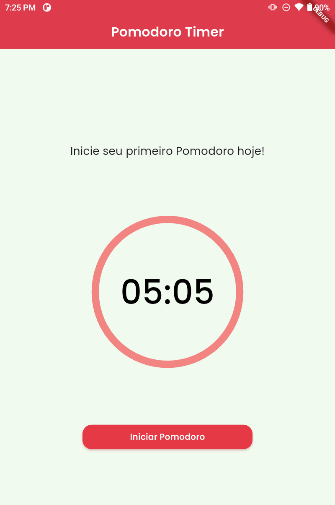

# Pomodoro Timer (MVP)

Projeto de estudo / MVP em **Flutter** — objetivo: evolução contínua conforme meu aprendizado em Flutter. Cada versão adiciona funcionalidades e refina a UI/UX.

---

## Resumo rápido
App simples para aplicar o método Pomodoro: você trabalha `x` minutos e descansa `y` minutos. Foco em ser objetivo, testável e escalável para várias plataformas. Projeto open-source, licença MIT.

---

## Status atual
- UI em desenvolvimento conforme meu conhecimento atual em Flutter.  
- Projeto **não pronto** para produção.  
- Objetivo: primeiro release com recursos mínimos úteis e robustos.

---

---

## 📸 Screenshots



> Exemplo da tela principal do Pomodoro Timer. À medida que novas funcionalidades forem implementadas, novas screenshots serão adicionadas.


---

## Plataformas suportadas
Android, iOS, Web, macOS, Windows e Linux (multiplataforma via Flutter).  

---

## Tecnologias
- **Dart** ^3.9.2  
- **Flutter** (compatível com sua versão local)  

---

## Bibliotecas / Ferramentas usadas

| Biblioteca | Versão | Link |
|------------|--------|------|
| flutter_native_splash | ^2.4.7 | [pub.dev](https://pub.dev/packages/flutter_native_splash) |
| google_fonts | ^6.3.2 | [pub.dev](https://pub.dev/packages/google_fonts) |
| percent_indicator | ^4.2.5 | [pub.dev](https://pub.dev/packages/percent_indicator) |
| flutter_launcher_icons | ^0.14.4 (dev) | [pub.dev](https://pub.dev/packages/flutter_launcher_icons) |
| rename_app | ^1.6.5 | [pub.dev](https://pub.dev/packages/rename_app) |

Fonte do app: **Poppins** via [Google Fonts](https://fonts.google.com/specimen/Poppins).

---

## Funcionalidades esperadas na primeira release oficial
1. **Modo cronômetro** e **modo timer** (count-up e count-down).  
2. **Gráficos/visão geral** do desempenho (resumo por dia/semana).  
3. **Notas** para cada bloco (marcar se foi estudo, trabalho, descanso etc.).  
4. **Histórico offline** (futuramente: sincronização online).

---

## Como rodar
```bash
flutter pub get
flutter run -d <seu_dispositivo>
````

### Gerar splash nativo

```bash
flutter pub run flutter_native_splash:create
```

### Gerar ícones de app

```bash
flutter pub run flutter_launcher_icons:main
```

> Confirme os comandos exatos na versão do pacote utilizada.

---

## Roadmap curto

* [x] Timer core (start/pause/reset)
* [ ] Modo cronômetro + modo timer completos
* [ ] Persistência local do histórico
* [ ] UI dos gráficos com `percent_indicator`
* [ ] Notas por sessão
* [ ] Preparar primeira release (versões, ícones, splash)

---

## Contribuições

* Fork → branch com sua feature → PR com descrição clara do objetivo.
* Testes e code style são bem-vindos.

---

## Licença

MIT License — projeto open-source.

---

## Observações finais

* Projeto **de estudo**: foco principal é aprender Flutter e evoluir a arquitetura/UX.
* Não é código pronto para produção até termos autenticação, testes e CI.
